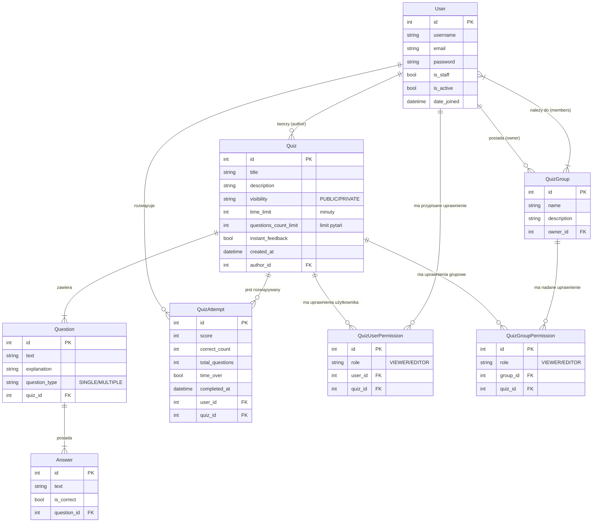

# Schemat Bazy Danych (ERD)

```mermaid
erDiagram
    %% Tabela Użytkowników (Custom User)
    User {
        int id PK
        string username
        string email
        string password
        bool is_staff
        bool is_active
        datetime date_joined
    }

    %% Aplikacja QUIZZES
    Quiz {
        int id PK
        string title
        string description
        string visibility "PUBLIC/PRIVATE"
        int time_limit "minuty"
        int questions_count_limit "limit pytań"
        bool instant_feedback
        datetime created_at
        int author_id FK
    }

    Question {
        int id PK
        string text
        string explanation
        string question_type "SINGLE/MULTIPLE"
        int quiz_id FK
    }

    Answer {
        int id PK
        string text
        bool is_correct
        int question_id FK
    }

    QuizGroup {
        int id PK
        string name
        string description
        int owner_id FK
    }

    QuizAttempt {
        int id PK
        int score
        int correct_count
        int total_questions
        bool time_over
        datetime completed_at
        int user_id FK
        int quiz_id FK
    }

    %% Tabele Uprawnień (Explicit Models)
    QuizUserPermission {
        int id PK
        string role "VIEWER/EDITOR"
        int user_id FK
        int quiz_id FK
    }

    QuizGroupPermission {
        int id PK
        string role "VIEWER/EDITOR"
        int group_id FK
        int quiz_id FK
    }

    %% RELACJE
    %% Jeden user ma wiele quizów (autor)
    User ||--o{ Quiz : "tworzy (author)"
    
    %% Jeden user ma wiele grup (właściciel)
    User ||--o{ QuizGroup : "posiada (owner)"
    
    %% Relacja Many-to-Many: Userzy należą do grup
    %% (W Django to tabela ukryta, tu pokazujemy logiczne połączenie)
    User }|--|{ QuizGroup : "należy do (members)"

    %% User ma wiele podejść do quizów
    User ||--o{ QuizAttempt : "rozwiązuje"

    %% Struktura Quizu
    Quiz ||--|{ Question : "zawiera"
    Question ||--|{ Answer : "posiada"
    
    %% Logika podejść
    Quiz ||--o{ QuizAttempt : "jest rozwiązywany"

    %% Uprawnienia
    Quiz ||--o{ QuizUserPermission : "ma uprawnienia użytkownika"
    User ||--o{ QuizUserPermission : "ma przypisane uprawnienie"
    
    Quiz ||--o{ QuizGroupPermission : "ma uprawnienia grupowe"
    QuizGroup ||--o{ QuizGroupPermission : "ma nadane uprawnienie"
```