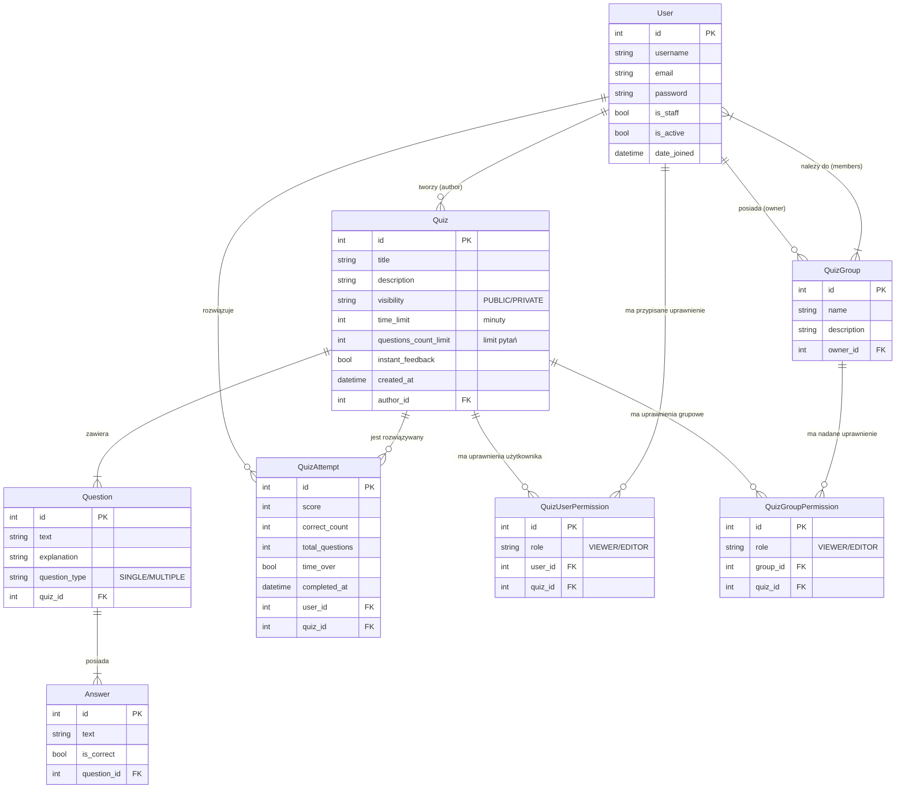

# Schemat Bazy Danych (ERD)

## Opis Modeli Danych (Słownik Danych)

Poniższa tabela opisuje rolę poszczególnych encji w systemie oraz kluczowe decyzje projektowe.

| Model (Encja) | Aplikacja | Opis i Odpowiedzialność |
| :--- | :--- | :--- |
| **User** | `accounts` | Niestandardowy model użytkownika dziedziczący po `AbstractUser`. Pozwala na łatwą rozbudowę profilu w przyszłości bez naruszania struktury `auth_user`. |
| **Quiz** | `quizzes` | Centralna encja systemu. Przechowuje metadane quizu (tytuł, widoczność) oraz konfigurację rozgrywki (`time_limit`, `instant_feedback`). |
| **Question** | `quizzes` | Pojedyncze pytanie przypisane do quizu. Obsługuje różne typy pytań (jednokrotny/wielokrotny wybór) zdefiniowane w polu `question_type`. |
| **Answer** | `quizzes` | Odpowiedź do pytania. Zawiera flagę `is_correct`, która determinuje poprawność zaznaczenia. |
| **QuizGroup** | `quizzes` | Grupa użytkowników (np. "Klasa 3B"). Pozwala na masowe udostępnianie prywatnych quizów wielu osobom naraz. |
| **QuizAttempt** | `quizzes` | Historia wyników. Każdy rekord to jedno zakończone podejście do quizu, zawierające wynik punktowy, procentowy i czas wykonania. |

## Mechanizmy i Relacje

### 1. System Uprawnień (RBAC)
Zamiast polegać wyłącznie na prostych flagach, system wykorzystuje **tabele pośrednie** do zarządzania dostępem do prywatnych quizów. Pozwala to na elastyczne nadawanie ról:

* **QuizUserPermission**: Łączy bezpośrednio użytkownika z quizem, nadając mu rolę `VIEWER` (może rozwiązywać) lub `EDITOR` (może edytować).
* **QuizGroupPermission**: Łączy grupę użytkowników z quizem. Wszyscy członkowie grupy dziedziczą uprawnienia nadane grupie.

### 2. Logika Podejść (Attempts)
Model `QuizAttempt` jest tworzony w momencie zakończenia quizu.
* Wynik (`score`) jest obliczany po stronie serwera, aby zapobiec manipulacjom.
* Dla zachowania integralności danych historycznych, podejście jest powiązane z użytkownikiem relacją, która dopuszcza wartość `NULL` (w przypadku usunięcia konta użytkownika, jego statystyki pozostają w systemie jako anonimowe).

## Uwagi Techniczne

* **Silnik Bazy Danych:** Projekt domyślnie wykorzystuje **SQLite** (plik `db.sqlite3`) ze względu na łatwość konfiguracji w środowisku deweloperskim. W środowisku produkcyjnym zalecana jest migracja na **PostgreSQL**.
* **Migracje:** Wszelkie zmiany w strukturze bazy danych są wersjonowane przy użyciu systemu migracji Django (`python manage.py makemigrations` / `migrate`), co zapewnia spójność schematu między środowiskami.